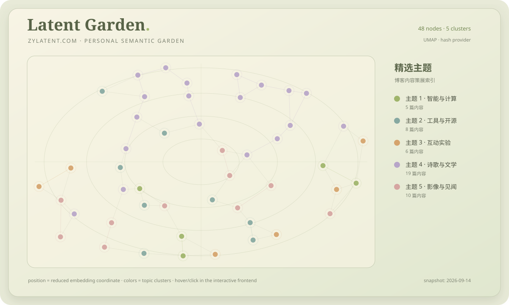

# Latent Garden

[](https://github.com/ZhouYinLong-lab/Latent-Garden/actions/workflows/ci.yml)
[](https://www.python.org/)
[](LICENSE)

Latent Garden 是一个独立的语义地图生成工具。它读取 Markdown、MDX、JSON、RSS/Atom 或公开网站内容，提取统一的内容字段，生成 embedding，经 UMAP 降维与主题聚类后输出前端可直接消费的 `garden.json`。

它不是某个博客的专用插件。博客、项目集、研究笔记、知识库和文档站都可以通过 JSON、静态页面、iframe 或 API 使用同一套处理流程。

## 在线交互地图

**[打开 Latent Garden 交互语义地图 ↗](https://latent-garden.zylatent.com/)**

这是由 `frontend/` 自动部署的 GitHub Pages 实例，支持搜索、主题筛选、缩放、拖拽和点击文章节点。README 中的静态图适合快速预览，在线页面提供完整交互。

## 博客案例：寒柳别苑

Latent Garden 的第一个真实使用案例是个人博客 [zylatent.com（寒柳别苑）](https://zylatent.com)。仓库中的案例数据由博客公开页面生成，不依赖博客源码，也不把文章正文写入最终地图文件。

当前案例快照：

| 项目 | 结果 |
| --- | --- |
| 内容来源 | [zylatent.com](https://zylatent.com) 公开文章 |
| 地图节点 | 41 |
| 主题分组 | 5 |
| 降维方法 | UMAP |
| 聚类方法 | K-Means |
| 输出文件 | [`examples/zylatent-garden.json`](examples/zylatent-garden.json) |
| 独立前端 | [`frontend/`](frontend/) |

这份输出保留每篇文章的标题、摘要、标签、日期、原始 URL、二维坐标和主题编号。打开节点后，地图会跳转回寒柳别苑的原文页面。

静态预览如下；它来自同一份 `garden.json`，完整地图支持搜索、主题筛选、缩放、拖拽和点击跳转：

[](frontend/)

> 这不是词频词云：每个点是一篇文章，点与点之间的距离表示语义相似度，颜色表示聚类结果。坐标轴本身没有固定的人类语义。

重新生成博客案例：

```bash
pip install -e ".[analysis]"
python -m pipeline.cli \
  --website https://zylatent.com \
  --output examples/zylatent-garden.json \
  --cache .latent-garden/zylatent-embeddings.json \
  --max-pages 6
cp examples/zylatent-garden.json frontend/garden.json
python -m http.server 8000 --directory frontend
```

然后访问 <http://localhost:8000>。也可以直接复用生成结果：

```text
https://your-site.example/latent-garden/?data=/garden.json&embed=1
```

## 特性

- 统一的 `ContentItem`、`GardenNode` 和 `Garden` 数据模型
- 可替换的 `EmbeddingProvider`，内置离线 hash provider 与 OpenAI provider
- 以内容 hash、provider、模型和维度为 key 的 embedding 缓存
- 可选真实 UMAP；没有科学计算依赖时仍可使用确定性降维回退
- K-Means 主题聚类与稳定的前端坐标范围
- Markdown、MDX、JSON、RSS、Atom 和公开网站适配器
- 零构建依赖的交互式前端，支持搜索、主题筛选、缩放、拖拽和原文跳转
- 可选 FastAPI 服务，提供 JSON、健康检查和受保护刷新接口
- GitHub Actions CI 与定期博客地图刷新

## 快速开始

要求 Python 3.10+。

```bash
git clone https://github.com/ZhouYinLong-lab/Latent-Garden.git
cd Latent-Garden
python -m venv .venv
source .venv/bin/activate       # Windows PowerShell: .\.venv\Scripts\Activate.ps1
pip install -e ".[analysis]"
```

使用示例内容生成地图：

```bash
python -m pipeline.cli \
  --input examples/content \
  --output examples/garden.json \
  --cache .latent-garden/examples-embeddings.json
cp examples/garden.json frontend/garden.json
python -m http.server 8000 --directory frontend
```

### 使用 OpenAI embedding

```bash
pip install -e ".[analysis]"
export OPENAI_API_KEY="your-key"  # Windows PowerShell: $env:OPENAI_API_KEY="your-key"
python -m pipeline.cli --input examples/content --output examples/garden.json --provider openai
```

### 运行 API

```bash
pip install -e ".[api]"
uvicorn api.server:app --host 0.0.0.0 --port 8000
```

API 提供 `/health`、`/garden.json`、`/api/garden`、`/api/refresh` 和 `/frontend/`。生产部署、Docker 与定时刷新见 [`docs/deployment.md`](docs/deployment.md)。

## 输入与输出

Markdown/MDX 使用 YAML frontmatter：

```markdown
---
title: A note
description: Short summary
tags: [design, note]
date: 2026-01-01
url: https://example.com/note
type: article
---

正文会参与 embedding，但不会写入 garden.json。
```

JSON 可以是单个对象、对象数组或 `{ "items": [...] }`。常用字段为 `id`、`title`、`description`、`body/content/text`、`tags`、`date`、`url` 和 `type`。

输出节点至少包含：

```json
{
  "id": "thinking-in-gardens",
  "title": "Thinking in gardens",
  "description": "Short summary",
  "tags": ["writing", "knowledge"],
  "date": "2026-01-18",
  "url": "https://example.com/notes/thinking-in-gardens",
  "content_type": "article",
  "x": 0.12,
  "y": -0.34,
  "cluster_id": 0
}
```

## 工作流

```text
Content source → Adapter → ContentItem → EmbeddingProvider
                                      ↓
                              hash cache lookup
                                      ↓
                         UMAP reducer → Clusterer
                                      ↓
                              garden.json → Frontend/API
```

详细设计见 [`docs/architecture.md`](docs/architecture.md)。

## 仓库结构

```text
latent-garden/
├── core/                  # 稳定的数据模型
├── pipeline/              # 加载、缓存、embedding、降维、聚类与 CLI
├── providers/             # EmbeddingProvider 实现
├── adapters/              # Markdown、JSON、RSS/Atom、网站适配器
├── api/                   # 可选 FastAPI 服务
├── frontend/              # 独立交互式语义地图
├── examples/              # 示例内容与 zylatent.com 输出
├── tests/                 # 单元与 API 契约测试
├── docs/                  # 架构和部署文档
│   └── assets/            # README 使用的案例地图预览
├── scripts/               # 可重复运行的生成辅助脚本
├── .github/               # CI、定时刷新与 Issue/PR 模板
├── pyproject.toml         # Python 包和可选依赖
└── README.md              # 项目入口
```

## 文档与项目规范

- [`docs/architecture.md`](docs/architecture.md)：模块边界与扩展点
- [`docs/deployment.md`](docs/deployment.md)：静态、API、Docker 和定时刷新
- [`CONTRIBUTING.md`](CONTRIBUTING.md)：开发、测试和 Pull Request 流程
- [`CODE_OF_CONDUCT.md`](CODE_OF_CONDUCT.md)：社区参与准则
- [`SECURITY.md`](SECURITY.md)：漏洞报告方式
- [`CHANGELOG.md`](CHANGELOG.md)：版本变化记录
- [`docs/releasing.md`](docs/releasing.md)：维护者发布流程

## 参与贡献

欢迎提交适配器、EmbeddingProvider、可视化改进和文档修正。开始前请阅读 [`CONTRIBUTING.md`](CONTRIBUTING.md)，并通过 [GitHub Issues](https://github.com/ZhouYinLong-lab/Latent-Garden/issues) 报告问题或提出功能建议。

## 许可证

Latent Garden 使用 [MIT License](LICENSE)。

## 致谢

感谢 [UMAP-learn](https://github.com/lmcinnes/umap)、[scikit-learn](https://scikit-learn.org/)、[FastAPI](https://fastapi.tiangolo.com/) 以及 Python 开源社区提供的基础工具。

项目主页：[github.com/ZhouYinLong-lab/Latent-Garden](https://github.com/ZhouYinLong-lab/Latent-Garden)
